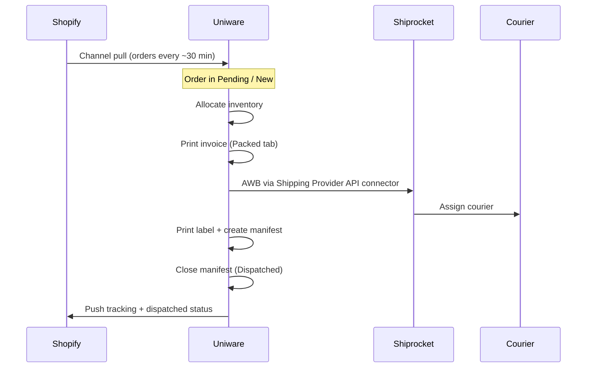
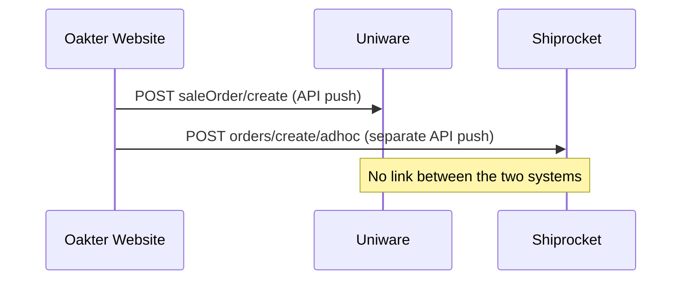
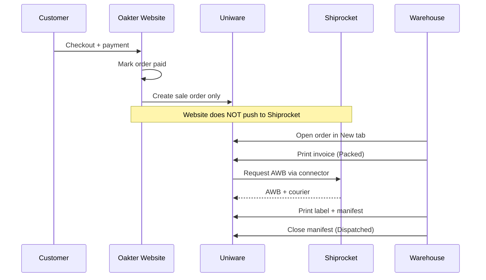

# Uniware-centric fulfillment (Shopify parity)

**Status:** Saved for future implementation  
**Decision:** Uniware only — Shiprocket via Uniware shipping provider connector (not direct website API)  
**Created:** 2026-07-07

---

## What the Uniware admin described (Shopify era)

In the Shopify setup, **Uniware was the single operations hub**. Shiprocket was not fed directly from the website.

### How Shopify connected to Uniware

- **Built-in cart channel** (Settings → Channels → Shopify), not a custom website API.
- Uniware **pulls** paid orders from Shopify using Shopify Admin API credentials.
- [Shopify integration KB](https://support.unicommerce.com/index.php/knowledge-base/integration-with-shopify/):
  - Orders are **self-shipped** (seller handles logistics).
  - **Invoice template + tax** configured inside Uniware.
  - Uniware provides **tracking + label print**.
  - Status sync: **Cancellation** and **Dispatched** between Shopify ↔ Uniware.

### How Shiprocket connected to Uniware (not to Shopify)

- Shiprocket added in Uniware under **Settings → Shipping Providers** with **AWB Generation = API** and credentials in **Connectors**.
- [Shiprocket integration guide](https://support.shiprocket.in/support/solutions/articles/43000659888-how-do-i-integrate-unicommerce-with-shiprocket-)
- Warehouse workflow in Uniware:
  1. **New** → allocate inventory
  2. **Print invoice** → **Packed**
  3. **Generate label** → Uniware calls Shiprocket → AWB assigned
  4. **Ready to Ship** → manifest → **Dispatched**

Invoice generation is a **Uniware fulfillment step**, not something Shiprocket triggers independently.

---

## What Oakter does today

On payment success, `CheckoutPaymentCompletionService` dispatches **two independent jobs**:

| Area | Shopify + Uniware | Oakter today |
|------|-------------------|--------------|
| Order entry to Uniware | Channel pull | API push via `UnicommerceOrderMapper` |
| Order entry to Shiprocket | Not from website | Direct adhoc API via `ShiprocketOrderMapper` |
| Invoice generation | Uniware UI (Print Invoice) | Not implemented |
| AWB / courier | Uniware → Shiprocket connector | Website pushes to Shiprocket; Uniware unaware |
| Label + manifest | Uniware fulfillment tabs | Not in Oakter |
| Tracking back to storefront | Uniware → Shopify | Not implemented |

### Shipment keys sent to Uniware today

From `app/Services/Unicommerce/UnicommerceOrderMapper.php`:

- `shippingAddress`, `addresses`, `shippingMethodCode` (`STD`), `shippingCharges`, `packetNumber`
- **Not sent:** `thirdPartyShipping`, `shippingProviders`, `fulfillmentTat`, invoice fields

### Uniware APIs used today

Only:

- OAuth token
- `POST /services/rest/v1/oms/saleOrder/create`

**Not used:** invoice, shipping package, allocate provider, dispatch/forceDispatch, webhooks.

---

## Root cause

**Old flow:** Website → Uniware → Uniware processes → Shiprocket connector → Uniware dispatches

**Current flow:** Website → Uniware **AND** Website → Shiprocket (duplicate intake, connector bypassed)

---

## Recommended implementation (future)

**Push orders to Uniware only.** Shiprocket only via Uniware Shipping Provider integration.

### Code changes

1. **Stop direct Shiprocket sync from website**
   - Disable `SyncOrderToShiprocketJob` in `CheckoutPaymentCompletionService` (env flag default `false`).
   - Disable or remove `CancelOrderInShiprocketJob` for new orders if no direct pushes.
   - Update `resources/views/admin/orders/show.blade.php` — Uniware-only fulfillment messaging.

2. **Keep Uniware create-sale-order as sole outbound integration**
   - `UnicommerceOrderMapper` unchanged unless Uniware team requests extra fields.

3. **Uniware admin checklist (non-code)**
   - Shiprocket under Settings → Shipping Providers, AWB = API.
   - Valid Shiprocket connector credentials.
   - Invoice template configured.
   - Warehouse: invoice → label → manifest in Uniware.
   - Clean up duplicate `OAKTER-*` adhoc orders in Shiprocket from earlier website pushes.

4. **Optional later**
   - `customFieldValues` for shipping days estimate on sale order create.
   - Uniware webhook/polling for AWB + dispatch in Oakter admin.
   - Cancel sale order in Uniware on admin refund.

### Do not build (Uniware-only model)

- Website → Shiprocket adhoc API on payment.
- Shiprocket AWB → Uniware `forceDispatch` bridge (unless warehouse refuses Uniware UI).

---

## Behavior after changes

### Customer / website

- Checkout and payment unchanged.
- Shipping estimate from admin settings unchanged.
- Customer does not interact with Uniware or Shiprocket directly.

### Immediately after payment

| Today | After change |
|--------|----------------|
| Push to Uniware + Shiprocket | Push to **Uniware only** |
| Two records (`OAKTER-{id}`) | One record in Uniware |
| Shiprocket may have adhoc order before warehouse acts | Shiprocket gets order when Uniware requests AWB at label step |

**Oakter admin:**

- Uniware sync: same (`pending` → `synced` / `failed`, resync available).
- Shiprocket sync: no new website pushes; existing fields remain for historical orders.

### Warehouse team

All fulfillment in **Uniware** (same as Shopify):

1. New — order from Oakter API sync
2. Print invoice — Packed
3. Generate label — Uniware → Shiprocket connector
4. Ready to ship — manifest
5. Dispatched — close manifest

### Shiprocket panel

- New orders appear only when Uniware creates shipment/AWB.
- Old `OAKTER-*` adhoc orders may need cleanup to avoid duplicate shipments.
- Primary workspace: Uniware, not Shiprocket panel for website orders.

### Cancellations

| Today | After change |
|--------|----------------|
| Oakter cancels in Shiprocket via API | No automatic Shiprocket cancel for new orders |
| No Uniware cancel API | Manual cancel in Uniware (like Shopify) unless cancel API added later |

### Oakter admin visibility

**Still shows:** payment, customer, Uniware sync status/code/errors.

**Won't auto-update for new orders:** Shiprocket IDs, AWB, courier, dispatch (unless status sync built later).

**UI:** De-emphasize Shiprocket resync; note that fulfillment runs in Uniware.

### Risks if process not updated

- Duplicate shipments (old Shiprocket adhoc + new Uniware flow).
- “Missing in Shiprocket” until label generated in Uniware.
- “Missing invoice” if team uses Shiprocket panel instead of Uniware invoice step.

---

## Implementation todos

- [ ] Disable `SyncOrderToShiprocketJob` on payment (env flag default false) + admin UI messaging
- [ ] Confirm with Uniware admin: Shiprocket provider + API AWB + invoice template
- [ ] Audit/cancel duplicate `OAKTER-*` adhoc orders in Shiprocket
- [ ] Later: Uniware dispatch/AWB visibility on Oakter admin order page

---

## Key files (reference)

| File | Role |
|------|------|
| `app/Services/Checkout/CheckoutPaymentCompletionService.php` | Dispatches sync jobs on payment |
| `app/Jobs/SyncOrderToUnicommerceJob.php` | Uniware sync queue job |
| `app/Jobs/SyncOrderToShiprocketJob.php` | Shiprocket sync (to disable) |
| `app/Services/Unicommerce/UnicommerceOrderMapper.php` | Uniware create payload |
| `app/Services/Shiprocket/ShiprocketOrderMapper.php` | Shiprocket adhoc payload |
| `resources/views/admin/orders/show.blade.php` | Admin order integration UI |

---

## Summary for Uniware admin

| Question | Answer |
|----------|--------|
| Did Shopify talk to Shiprocket directly? | No — Shopify → Uniware → Shiprocket |
| Why did invoice auto-generate before? | Uniware fulfillment workflow before label/manifest |
| What is Oakter doing differently? | Two separate orders from website, bypassing connector |
| What should we change? | Push to Uniware only; warehouse works in Uniware as before |
